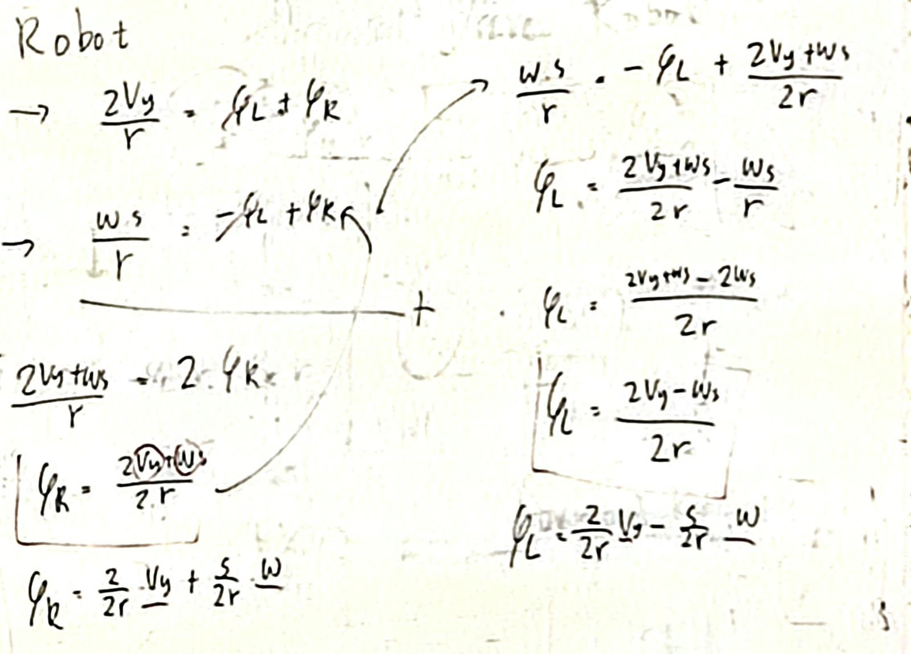
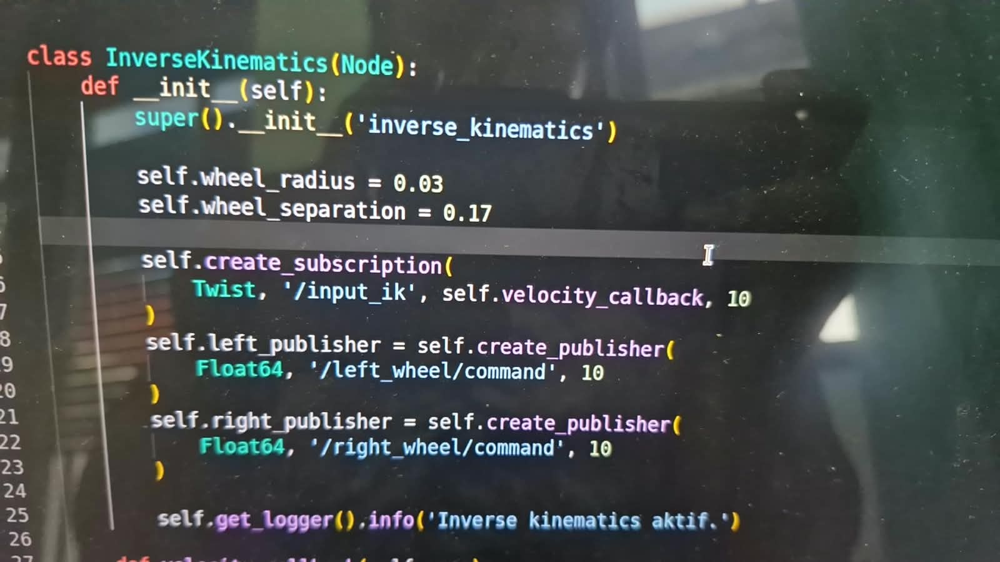

# RI FK/IK — ROS 2 Differential Drive Kinematics

ROS 2 package for implementing **Inverse Kinematics (IK)** of a differential-drive mobile robot.

This package converts the robot's linear and angular velocity into individual left and right wheel angular velocities using the standard differential-drive inverse kinematics model.

---

## Overview

For a differential-drive robot, the desired robot velocity can be represented by:

* **Linear velocity (`V`)** — movement along the robot's forward axis.
* **Angular velocity (`ω`)** — rotational velocity around the robot's vertical axis.

The inverse kinematics node converts these values into:

* Left wheel angular velocity (`φL`)
* Right wheel angular velocity (`φR`)

The implemented system is designed to work with the **Robin mobile robot** configuration.

---

## Robot Parameters

The current robot parameters used by the inverse kinematics node are:

| Parameter        |  Value | Unit |
| ---------------- | -----: | ---- |
| Wheel radius     | `0.03` | m    |
| Wheel separation | `0.17` | m    |

These parameters are based on the robot description and bringup packages:

* [robin_bringup](https://github.com/Bakso14/robin_bringup)
* [robin_description](https://github.com/Bakso14/robin_description)

---

## Features

* ROS 2 Python node using `rclpy`
* Differential-drive inverse kinematics
* Accepts initial velocity through terminal arguments
* Supports velocity updates through the `/input_ik` topic
* Publishes left and right wheel angular velocities
* Publishes wheel commands at a fixed 10 Hz rate
* Uses standard ROS 2 message types:

  * `geometry_msgs/msg/Twist`
  * `std_msgs/msg/Float64`

---

## Package Structure

```text
ri_fk_ik/
├── ri_fk_ik/
│   └── inverse_kinematics.py
├── package.xml
├── setup.py
└── README.md
```

---

## Inverse Kinematics

The inverse kinematics equations used in this package are:

```text
φL = (2V - ωL) / (2R)

φR = (2V + ωL) / (2R)
```

where:

| Symbol | Description                            | Unit  |
| ------ | -------------------------------------- | ----- |
| `V`    | Robot linear velocity                  | m/s   |
| `ω`    | Robot angular velocity                 | rad/s |
| `L`    | Distance between left and right wheels | m     |
| `R`    | Wheel radius                           | m     |
| `φL`   | Left wheel angular velocity            | rad/s |
| `φR`   | Right wheel angular velocity           | rad/s |

The implementation follows:

```python
phi_L = (2 * ThisVel - ThisOmega * ThisSeparation) / (2 * ThisRadius)
phi_R = (2 * ThisVel + ThisOmega * ThisSeparation) / (2 * ThisRadius)
```

## ROS 2 Communication

### Subscriber

The node subscribes to:

```text
/input_ik
```

Message type:

```text
geometry_msgs/msg/Twist
```

The following fields are used:

```text
msg.linear.x
msg.angular.z
```

Therefore:

```text
V     ← /input_ik.linear.x
ω     ← /input_ik.angular.z
```

The subscriber implementation is:

```python
self.create_subscription(
    Twist,
    '/input_ik',
    self.velocity_callback,
    10
)
```

## Publishers

The node publishes the calculated wheel velocities to two topics.

### Left Wheel

```text
Topic: /left_wheel/command
Type: std_msgs/msg/Float64
```

The published value is:

```text
φL
```

### Right Wheel

```text
Topic: /right_wheel/command
Type: std_msgs/msg/Float64
```

The published value is:

```text
φR
```

---

## Node

The node name is:

```text
inverse_kinematics
```

The node continuously performs the following process:

```text
             /input_ik
                 │
                 │ Twist
                 ▼
      ┌─────────────────────┐
      │ inverse_kinematics  │
      │                     │
      │ V = linear.x        │
      │ ω = angular.z       │
      │                     │
      │ Differential Drive  │
      │ Inverse Kinematics  │
      └──────────┬──────────┘
                 │
          ┌──────┴──────┐
          ▼             ▼
  /left_wheel/      /right_wheel/
    command            command
       │                  │
       ▼                  ▼
      φL                 φR
```

The wheel commands are published every **0.1 seconds**, corresponding to a frequency of:

```text
10 Hz
```

---

## Installation

Make sure ROS 2 is already installed and sourced.

Clone the repository into your ROS 2 workspace:

```bash
cd ~/ros2_ws/src
git clone https://github.com/FabrickDev/ri_fk_ik.git
```

Then build the package:

```bash
cd ~/ros2_ws
colcon build --packages-select ri_fk_ik
```

Source the workspace:

```bash
source install/setup.bash
```

---

## Running the Node

The inverse kinematics node accepts two optional terminal arguments:

```text
ros2 run ri_fk_ik inverse_kinematics <linear_velocity> <angular_velocity>
```

For example:

```bash
ros2 run ri_fk_ik inverse_kinematics 0.4 0.2
```

This starts the node with:

```text
Linear velocity  = 0.4 m/s
Angular velocity = 0.2 rad/s
```

The corresponding wheel velocities are calculated automatically.

---

## Example Calculation

Using:

```text
V = 0.4 m/s
ω = 0.2 rad/s
R = 0.03 m
L = 0.17 m
```

The left wheel velocity is:

```text
φL = (2(0.4) - 0.2(0.17)) / (2(0.03))
```

The right wheel velocity is:

```text
φR = (2(0.4) + 0.2(0.17)) / (2(0.03))
```

Resulting in approximately:

```text
φL = 12.77 rad/s
φR = 13.90 rad/s
```

Because the robot is commanded to rotate positively, the right wheel rotates faster than the left wheel.

---

## Testing the Subscriber

The initial velocity can be provided directly through the terminal:

```bash
ros2 run ri_fk_ik inverse_kinematics 0.4 0.2
```

After the node is running, velocity commands can also be sent through `/input_ik`.

For example:

```bash
ros2 topic pub /input_ik geometry_msgs/msg/Twist \
"{linear: {x: 0.4}, angular: {z: 0.2}}"
```

To inspect the incoming topic:

```bash
ros2 topic echo /input_ik
```

To inspect the left wheel command:

```bash
ros2 topic echo /left_wheel/command
```

To inspect the right wheel command:

```bash
ros2 topic echo /right_wheel/command
```

---

## Checking ROS 2 Interfaces

List available topics:

```bash
ros2 topic list
```

Check the topic type:

```bash
ros2 topic type /input_ik
```

Check the publishers and subscribers:

```bash
ros2 topic info /input_ik
```

Check the node:

```bash
ros2 node info /inverse_kinematics
```

---

## Velocity Priority

The node supports two ways of providing velocity:

1. **Terminal arguments**
2. **`/input_ik` subscriber**

The terminal arguments provide the **initial values**:

```bash
ros2 run ri_fk_ik inverse_kinematics 0.4 0.2
```

Once a `Twist` message is received through `/input_ik`, the node updates its velocity values using:

```python
self.Vel = msg.linear.x
self.Omega = msg.angular.z
```

Therefore, `/input_ik` can be used to dynamically change the robot's commanded velocity while the node is running.

---

## Dependencies

This package requires:

* ROS 2
* Python 3
* `rclpy`
* `geometry_msgs`
* `std_msgs`

The required ROS 2 interfaces are imported as:

```python
import rclpy
from rclpy.node import Node

from geometry_msgs.msg import Twist
from std_msgs.msg import Float64
```

---

## Related Repositories

The robot configuration used by this package is based on:

### Robin Bringup

https://github.com/Bakso14/robin_bringup

### Robin Description

https://github.com/Bakso14/robin_description

---

## Assets

The mathematical and ROS communication diagrams used in this repository are available in the `assets/` directory.

### Inverse Kinematics

```text
assets/ik.jpeg
```



### Subscriber Configuration

```text
assets/subscribers.jpeg
```



---

## License

This project is intended for educational, research, and robotics development purposes.

If you use or modify this package in another project, please provide appropriate attribution to the original repository.

---

## Author

**Electrical Engineering Class of 2023 C – Industrial Robotics**

1. Achmad Syahrul Ramadhan (23050874070)
2. Naufal Herjuno (23050874084)
3. Faqisna Putra Mardhatillah (23050874094)
